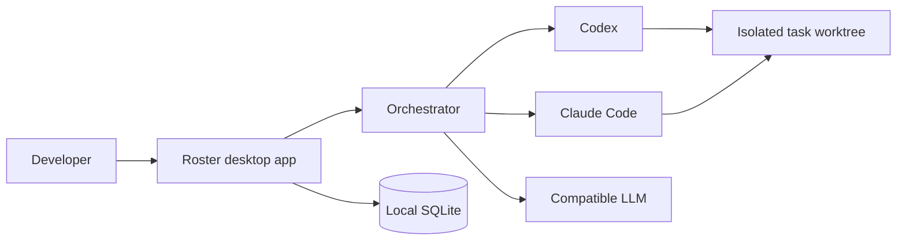

# Roster

**The open-source desktop workspace for verified AI engineering work.**

Roster gives local AI workers a shared home. Create specialists, organize teams, assign work, inspect changes, review approvals, and keep the full record on your machine.

It is built for developers who want the convenience of a messenger without losing visibility into what their agents are doing.

## Why Roster

AI coding tools are most useful when their work is easy to direct, review, and continue. Roster brings those pieces into one desktop app:

- Create persistent workers with their own role, instructions, memory, provider choice, and workspace.
- Organize workers into teams for structured handoffs and dependency-aware tasks.
- Send a constraint while work is active or queue a follow-up for later.
- Set one permission policy per worker, independent of their selected runtime.
- Give Git-backed coding tasks isolated worktrees that preserve the user's checkout.
- Track outcome contracts, acceptance criteria, review verdicts, evidence, and durable work receipts.
- Use bounded repair and re-review cycles when independent verification finds a problem.
- Resolve approvals and verification blockers in one Needs You inbox.
- Inspect actual Git changes relative to the task's starting revision.
- Resume interrupted work after a restart with its saved conversation and instructions.
- Keep conversations, attachments, task history, and local data under your control.

## Product status

Roster is an early desktop alpha. It is usable for local experimentation and active development, not yet a public production release. See [the release checklist](docs/RELEASE_CHECKLIST.md) and [known scope](#current-scope) before using it with an important repository.

## Quick start

### Requirements

- Node.js 24.14 or later
- npm
- A local Codex or Claude Code installation if you want to run those providers

### Run from source

```sh
git clone https://github.com/Vaibhav701161/Roster.git
cd roster
npm ci
npm run dev:desktop
```

The command starts Electron, the private loopback service, database migrations, provider detection, and the desktop window.

### Build installers

```sh
npm run package:win
npm run package:linux
npm run package:mac:arm64
npm run package:mac:x64
```

Windows builds an NSIS installer. Linux builds AppImage and deb packages. macOS builds separate DMG and ZIP artifacts for Apple Silicon and Intel Macs. macOS public distribution requires signing and notarization. See [Development](docs/DEVELOPMENT.md#macos-releases).

## Providers

| Provider                   | What Roster supports                                                                                                                   |
| -------------------------- | -------------------------------------------------------------------------------------------------------------------------------------- |
| Codex                      | Local sign-in detection, streaming, approval cards, cancellation, and session resume through the app-server protocol.                  |
| Claude Code                | Local executable detection, structured streaming, session IDs, cancellation, and usage reporting.                                      |
| OpenAI-compatible services | Streaming chat completions through a configured local or HTTPS endpoint. This adapter does not provide host filesystem or shell tools. |

Provider credentials are never stored in SQLite or returned through application state. The packaged desktop app uses OS-backed secure storage where Electron supports it.

## Engineering integrations

Roster maintains a local registry for GitHub, Playwright, Sentry, Vercel, CodeRabbit, Linear, Supabase, Slack, and Notion. Each integration has a narrow capability catalog and an approval-aware risk class. The app detects local GitHub, Vercel, CodeRabbit, Supabase, and Playwright tooling. Services that need an account remain clearly marked as unavailable or sign-in required until connected.

MCP servers can be discovered from Settings. Discovery records the server's capabilities and protected-resource authorization metadata without sending credentials. Remote endpoints must use HTTPS; loopback HTTP is supported for local development. OAuth authorization and tool execution are intentionally not enabled by discovery alone.

When a worker is attached to a project, it can inspect the local package scripts and project instruction files. You can explicitly save that inspection as a project profile, so later tasks in the same folder receive the relevant checks and instructions without relying on hidden context.

## How it works



The renderer and loopback service are internal parts of the desktop application. Roster does not expose a hosted control plane or send telemetry.

## Development

```sh
npm test
npm run test:ui
npm run lint
npm run build
```

`npm test` uses isolated local fixtures. `npm run test:ui` exercises the renderer with browser automation and an accessibility audit. Real-provider suites consume provider usage and require an existing local sign-in:

```sh
npm run test:e2e
npm run test:real-work
```

## Security and privacy

Roster binds its API to loopback, validates requests, scopes workspace operations, and shows runtime approvals in the chat. It does not use unrestricted provider access flags. Read [SECURITY.md](SECURITY.md) before filing a vulnerability report.

## Current scope

- Roster is desktop-only and local-first.
- Attachments are readable text and source files, limited to five files of 200 KB each.
- Git-backed coding work runs in task-scoped worktrees. Roster does not silently merge branches into the user's checkout.
- Reviews require a structured pass, concerns, fail, or unable-to-verify verdict. Concerns and failures can trigger up to three repair cycles before Roster asks for help.
- Outcome contracts, evidence, and receipts cover the current local workflow. Connected-service evidence and deployment workflows remain in the backlog.
- Real Claude Code acceptance has not been run on this development machine because Claude Code is not installed here.
- macOS signing, notarization, Gatekeeper, and hardware-specific provider testing require Apple credentials and Mac test hardware.

## Documentation

- [Product](docs/PRODUCT.md)
- [Architecture](docs/ARCHITECTURE.md)
- [Runtime](docs/RUNTIME.md)
- [Orchestration](docs/ORCHESTRATION.md)
- [Security](SECURITY.md)
- [Development](docs/DEVELOPMENT.md)
- [Release checklist](docs/RELEASE_CHECKLIST.md)

## Contributing

Roster is fully open source under the [MIT License](LICENSE). Contributions, bug reports, design feedback, and documentation improvements are welcome. Start with [CONTRIBUTING.md](CONTRIBUTING.md).

## Community standards

Please follow the [Code of Conduct](CODE_OF_CONDUCT.md). For security issues, use the private reporting process in [SECURITY.md](SECURITY.md), not a public issue.
